# 悦享家庭医生健康管理系统

基于 Spring Boot、Vue 和 HarmonyOS 开发的家庭医生健康管理系统。

项目包含 Web 管理端、HarmonyOS 移动端和 Spring Boot 后端。Web 端主要用于患者、健康档案、药品、用户和系统信息管理；HarmonyOS 端面向家庭医生和居民用户，提供移动端管理、健康信息查询、预约咨询和用药提醒等功能。

## 技术栈

### 后端

- Java
- Spring Boot
- Spring MVC
- MyBatis
- Maven
- MySQL
- RESTful API

### Vue Web 端

- Vue.js
- Vue Router
- Vuex
- Axios
- Element UI
- JavaScript
- HTML / CSS

### HarmonyOS 端

- HarmonyOS
- ArkTS
- ArkUI
- DevEco Studio
- Router
- Notification

## 项目结构

```text
housedoctor/
├── backend/              # Spring Boot 后端
│   ├── src/
│   └── pom.xml
│
├── web/                  # Vue Web 端
│   ├── src/
│   ├── static/
│   ├── package.json
│   └── vue.config.js
│
├── entry/                # HarmonyOS 应用
├── docs/                 # 项目截图
│   └── images/
│       ├── web/
│       └── harmony/
│
├── .gitignore
└── README.md
```

## 主要功能

系统主要分为家庭医生管理和居民健康服务两部分。

### 家庭医生及后台管理

- 患者信息管理
- 患者健康档案管理
- 诊断回复
- 药品库存管理
- 药品知识库管理
- 用户管理
- 角色管理
- 菜单管理
- 系统日志
- 系统公告
- 健康知识管理
- 服务对象数据统计

### 居民健康服务

- 个人健康信息查看
- 家庭医生服务
- 健康记录
- 报告查询
- 预约咨询
- 服务点选择
- 用药提醒
- 健康知识
- 个人信息管理

---

# Vue Web 端

Web 端主要提供家庭医生及后台管理功能，同时包含居民使用的健康服务页面。

## 登录

员工可以通过账号和密码登录系统。

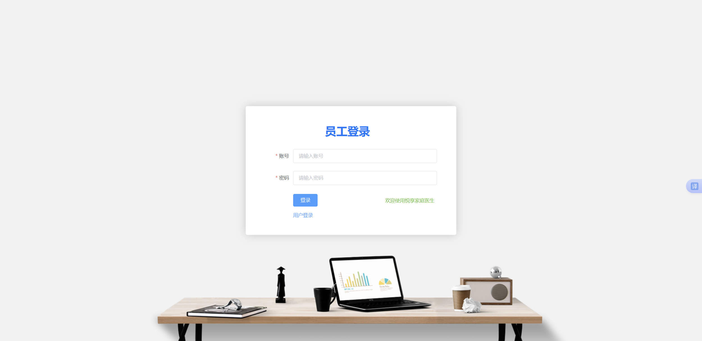

## 管理首页

登录后首页展示当前用户信息、系统公告、服务对象统计以及相关业务数据。

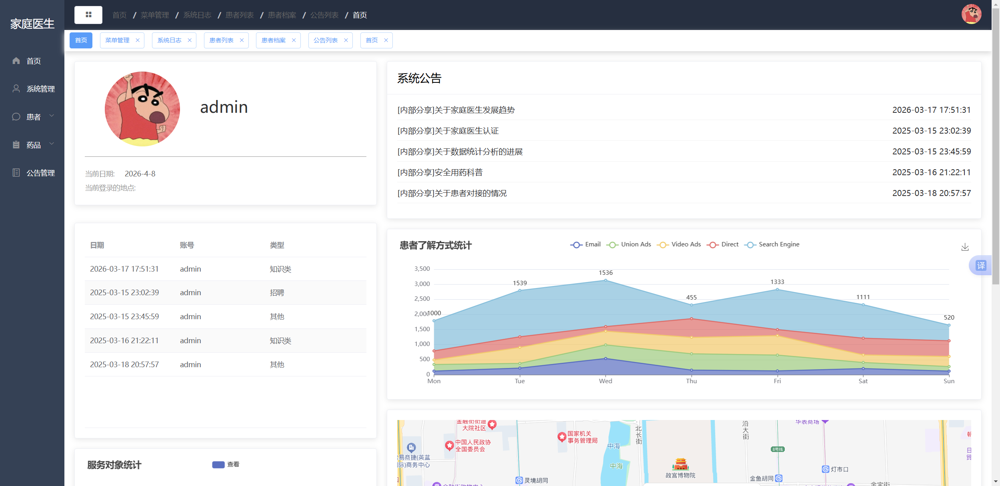

## 药品知识库管理

药品知识库用于维护系统中的药品信息，包括药品名称、介绍和药品类型等。

支持药品查询、新增、修改、删除以及分页查看。

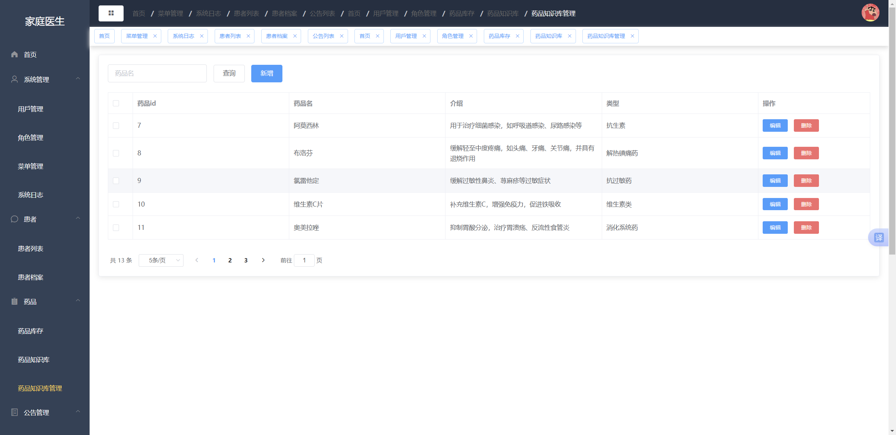

## 用户管理

后台可以查看和管理系统用户，包括用户名、邮箱、手机号、账号状态和创建时间等信息。

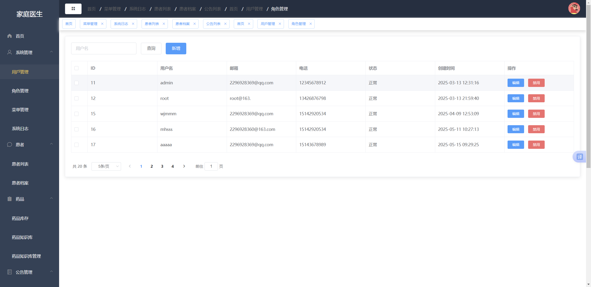

## 居民首页

居民登录后可以查看个人健康信息，并进入家庭医生、预约挂号、报告查询和用药提醒等功能。

首页同时展示健康标签、血型、过敏原以及近期健康情况。

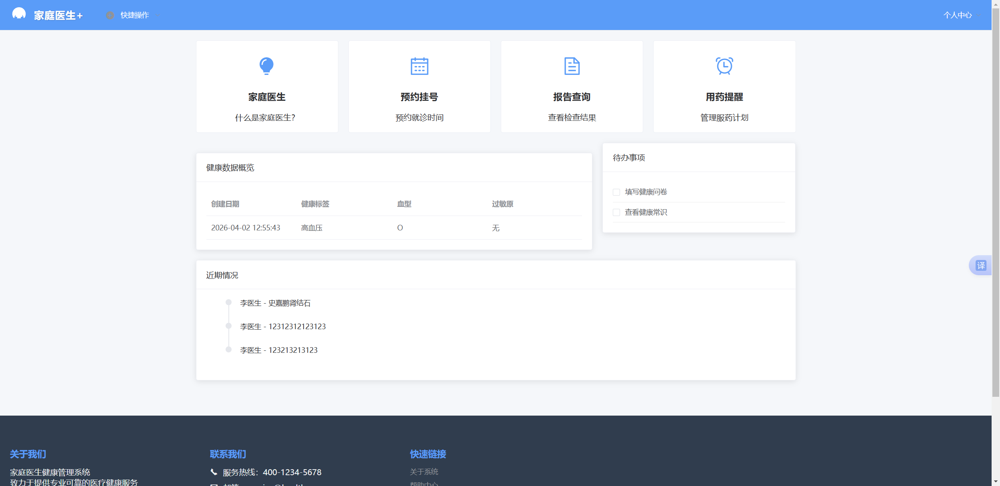

## 预约挂号

居民可以在线选择科室、医生和预约时间。

基本流程如下：

```text
选择科室
   ↓
选择医生
   ↓
选择预约时间
   ↓
填写症状
   ↓
确认并提交预约
```

系统会根据日期显示医生当前可预约的时间段。

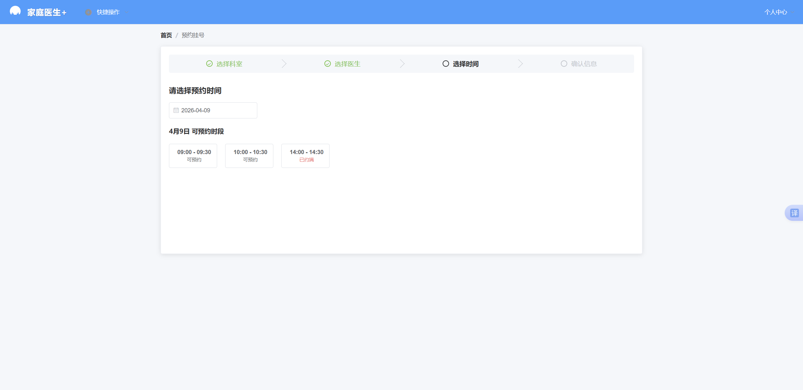

提交前可以再次确认就诊科室、医生、预约时间以及症状描述。

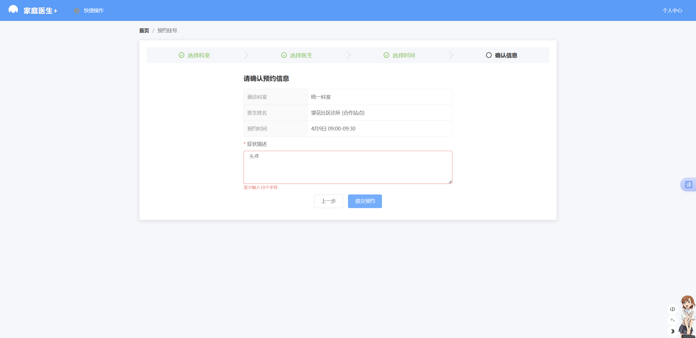

---

# HarmonyOS 端

HarmonyOS 端使用 ArkTS 和 ArkUI 开发，包含家庭医生端和居民端两种使用方式。

## 登录

移动端登录页面支持员工登录和用户登录。

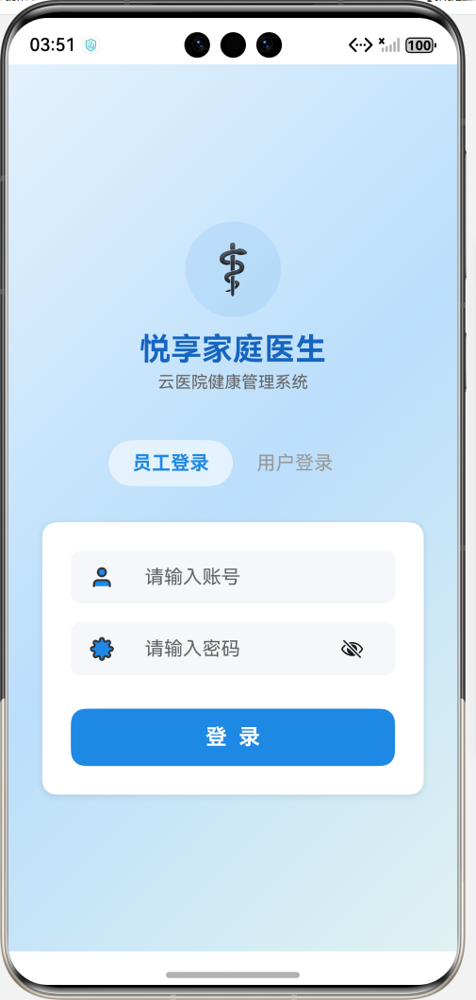

## 家庭医生首页

家庭医生登录后可以查看当前账号、日期、系统公告数量以及服务对象统计等信息。

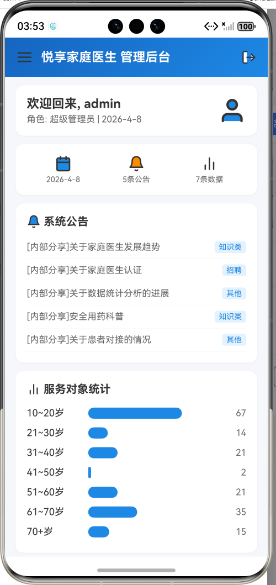

## 移动管理功能

HarmonyOS 端保留了部分 Web 后台管理能力，方便家庭医生通过移动设备处理业务。

目前包括：

- 患者管理
- 患者档案
- 诊断回复
- 药品知识库
- 药品知识管理
- 用户管理
- 角色管理
- 菜单管理
- 系统日志
- 公告管理
- 健康知识管理

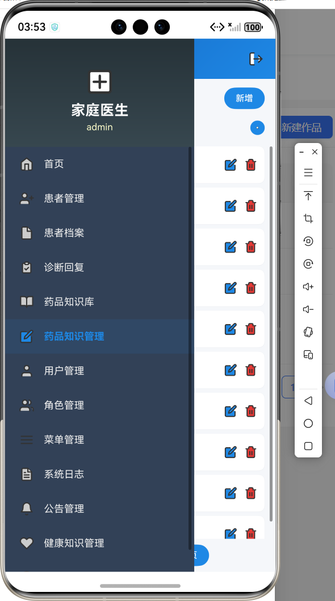

## 药品知识管理

家庭医生可以在移动端查看药品信息，并进行新增、编辑和删除操作。

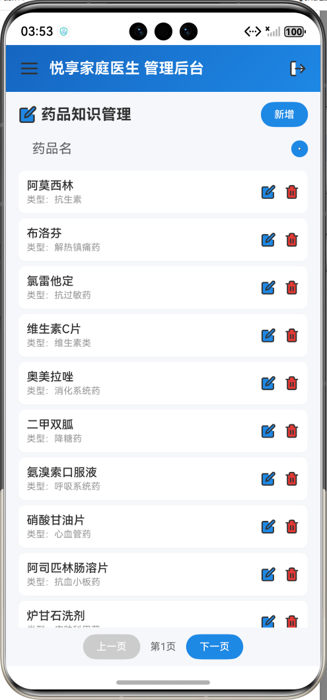

## 居民首页

居民端首页展示系统公告和个人健康数据，并提供家庭医生、健康记录、报告查询和用药提醒等入口。

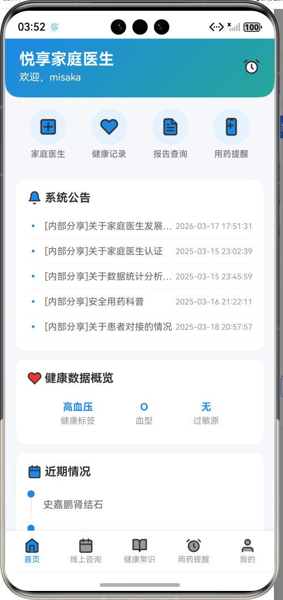

## 预约咨询

居民可以通过移动端进行预约咨询。

目前的预约流程包括选择服务点、选择时间和确认信息。

```text
选择服务点
   ↓
选择预约时间
   ↓
确认信息
   ↓
提交预约
```

服务点页面会显示服务点名称、类型、距离和地址等信息。

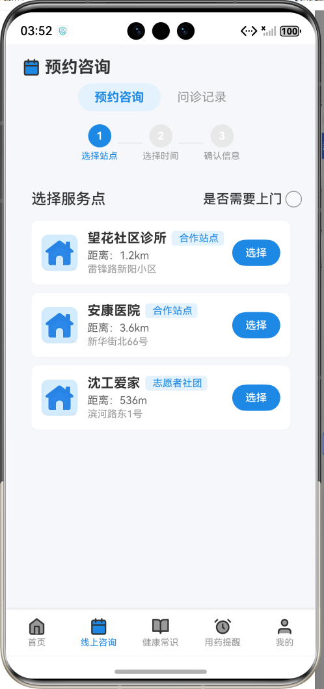

## 用药提醒

用户可以添加自己的用药计划，设置药品名称和服药时间。

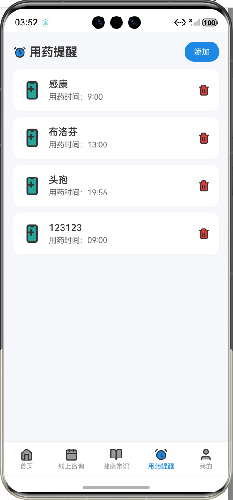

到达设定时间后，应用通过 HarmonyOS 系统通知提醒用户服药。

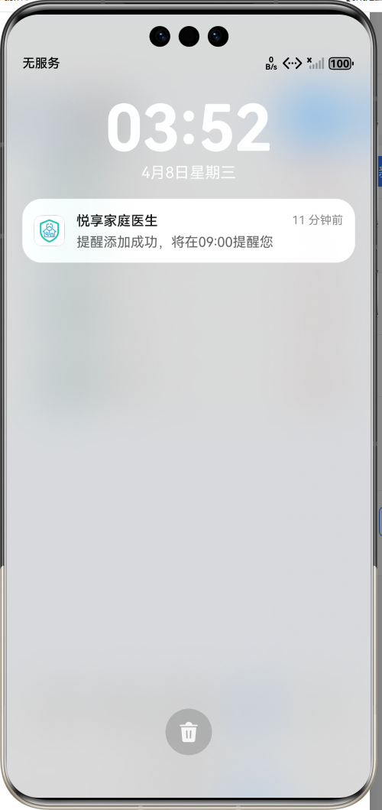

## 个人中心

个人中心用于查看账号、邮箱和手机号等基本信息，同时提供健康记录、报告查询和家庭医生介绍等入口。

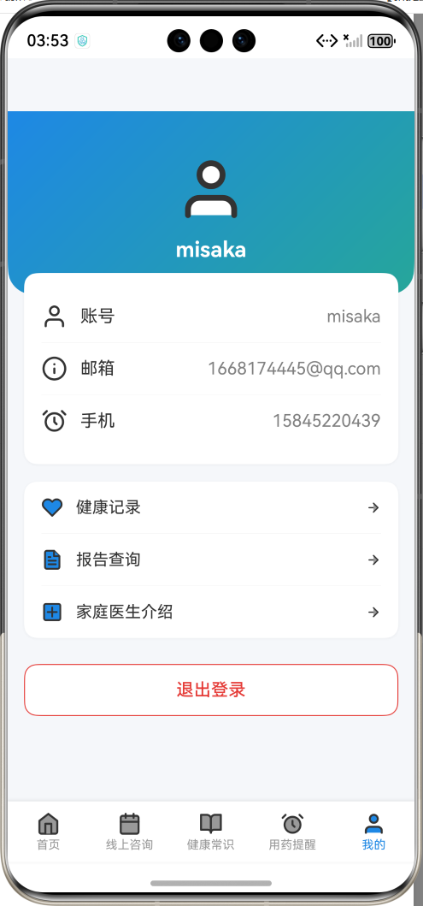

---

# 后端

后端使用 Spring Boot 开发，主要负责业务逻辑处理、数据库访问以及 Web 端和 HarmonyOS 端需要的接口。

项目按照 Controller、Service、Mapper、Entity 等层次组织代码。

```text
Controller
    ↓
Service
    ↓
Mapper
    ↓
MySQL
```

Web 端和 HarmonyOS 端通过后端接口访问业务数据。

```text
Vue Web ─────────┐
                 │
                 ├── Spring Boot ── MyBatis ── MySQL
                 │
HarmonyOS ───────┘
```

---

# 项目运行

## 后端

进入后端目录：

```bash
cd backend
```

安装依赖：

```bash
mvn clean install
```

启动项目：

```bash
mvn spring-boot:run
```

## Vue Web 端

进入 Web 目录：

```bash
cd web
```

安装依赖：

```bash
npm install
```

启动：

```bash
npm run dev
```

构建：

```bash
npm run build
```

## HarmonyOS 端

使用 DevEco Studio 打开项目，在配置好 HarmonyOS SDK 和签名后，可以通过模拟器或 HarmonyOS 设备运行。

---

# 项目说明

该项目主要用于家庭医生健康管理相关业务的开发实践。

目前实现了 Spring Boot 后端、Vue Web 端和 HarmonyOS 移动端，主要涉及患者管理、健康档案、药品知识、预约咨询、系统公告、用户权限和用药提醒等功能。

项目仍在继续完善中。